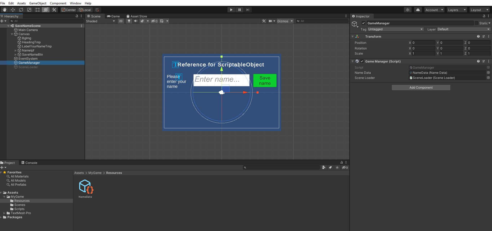

# smeerws-ScriptableObject

### Project description: 
This Unity project serves to show a variante to exchange information between scenes in Unity, scriptable objects. 

### Development platform: 
Windows 10, Unity 2020.1.5.f1, Visual Studio Community 2019

### Target platform: 
WebGL Refres: 960x600 

### Visuals: 

### Necessary setup/execution steps: 
None

### Third party material: 
Tutorial:
* https://www.youtube.com/watch?v=TjTL-MXPnbo

Documentation:
* https://docs.unity3d.com/2020.1/Documentation/Manual/class-ScriptableObject.html

### Project state: 
100%

### Limitations: 
None

### Lessons Learned: 
* create a scriptable object
* use a scriptable object (save variables in the scriptable object)

Copyright by smeerws
